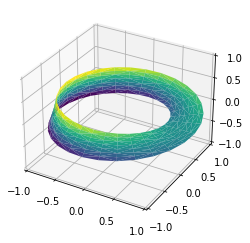
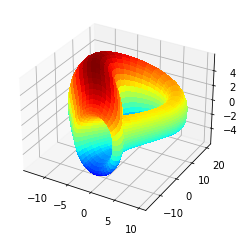

```python
'''Расчёт моды, медианы и среднего с помощью библиотек numpy и scipy'''
import numpy as np
from scipy import stats
sample = np.array([185, 175, 170, 169, 171, 175, 157, 172, 170, 172, 167, 173, 168, 167, 166,
              167, 169, 172, 177, 178, 165, 161, 179, 159, 164, 178, 172, 170, 173, 171])
# в numpy почему-то нет моды
print('mode:', stats.mode(sample))
print('median:', np.median(sample))
print('mean:', np.mean(sample))
```

    mode: ModeResult(mode=array([172]), count=array([4]))
    median: 170.5
    mean: 170.4


```python
# Корпус Мебиуса Пояса
 # Лента Мебиуса - это петля из бумажной ленты, сделанная путем скручивания листа бумаги на 180 градусов, а затем склеивания двух концов вместе.
 # Требует двух внутренних измерений.
 # Одно измерение определено как θ с диапазоном значений 0 ~ 2π, другое измерение - с диапазоном значений -1 ~ 1, указывающим ширину полосы Мёбиуса
    
import matplotlib.pyplot as plt    
ax = plt.axes(projection='3d')
    
theta = np.linspace(0, 2 * np.pi, 30)
w = np.linspace(-0.25, 0.25, 8)
w, theta = np.meshgrid(w, theta)
 # Найти два отношения вращения: во-первых, круг вращается вокруг центра круга (угол определяется как θ),
 # Другое состоит в том, что пояс Мебиуса вращается вокруг своей собственной оси координат (угол определяется как Φ).
 # Для ремня Мебиуса половина кольца должна быть повернута на 180 градусов, то есть ΔΦ = Δθ / 2
phi = 0.5 * theta
 # х-радиус в плоскости у
r = 1 + w * np.cos(phi)
x = np.ravel(r * np.cos(theta))
y = np.ravel(r * np.sin(theta))
z = np.ravel(w * np.sin(phi))
from matplotlib.tri import Triangulation
tri = Triangulation(np.ravel(w), np.ravel(theta))
ax.plot_trisurf(x, y, z, triangles=tri.triangles,cmap='viridis', linewidths=0.2)
ax.set_xlim(-1, 1)
ax.set_ylim(-1, 1)
ax.set_zlim(-1, 1)
plt.show()
```


    

    


```python
import mpl_toolkits.mplot3d.axes3d as axes3d
import matplotlib.pyplot as plt
import numpy as np
 
cos = np.cos
sin = np.sin
sqrt = np.sqrt
pi = np.pi
 
def surf(u, v):
    """
    http://paulbourke.net/geometry/klein/
    """
    half = (0 <= u) & (u < pi)
    r = 4*(1 - cos(u)/2)
    x = 6*cos(u)*(1 + sin(u)) + r*cos(v + pi)
    x[half] = (
        (6*cos(u)*(1 + sin(u)) + r*cos(u)*cos(v))[half])
    y = 16 * sin(u)
    y[half] = (16*sin(u) + r*sin(u)*cos(v))[half]
    z = r * sin(v)
    return x, y, z
 
u, v = np.linspace(0, 2*pi, 40), np.linspace(0, 2*pi, 40)
ux, vx =  np.meshgrid(u,v)
x, y, z = surf(ux, vx)
 
fig = plt.figure()
ax = fig.gca(projection = '3d')
plot = ax.plot_surface(x, y, z, rstride = 1, cstride = 1, cmap = plt.get_cmap('jet'),
                       linewidth = 0, antialiased = False)
 
plt.show()
```

    /var/folders/yr/bqlqv5t10wqb_84yt60z14zr0000gn/T/ipykernel_7155/2204974891.py:29: MatplotlibDeprecationWarning: Calling gca() with keyword arguments was deprecated in Matplotlib 3.4. Starting two minor releases later, gca() will take no keyword arguments. The gca() function should only be used to get the current axes, or if no axes exist, create new axes with default keyword arguments. To create a new axes with non-default arguments, use plt.axes() or plt.subplot().
      ax = fig.gca(projection = '3d')


    

    


Определение функции


```python
def greet_user():
    """Выводит простое приветсие."""
    print("Hello!")
    
greet_user()
```

    Hello!


```python

```
